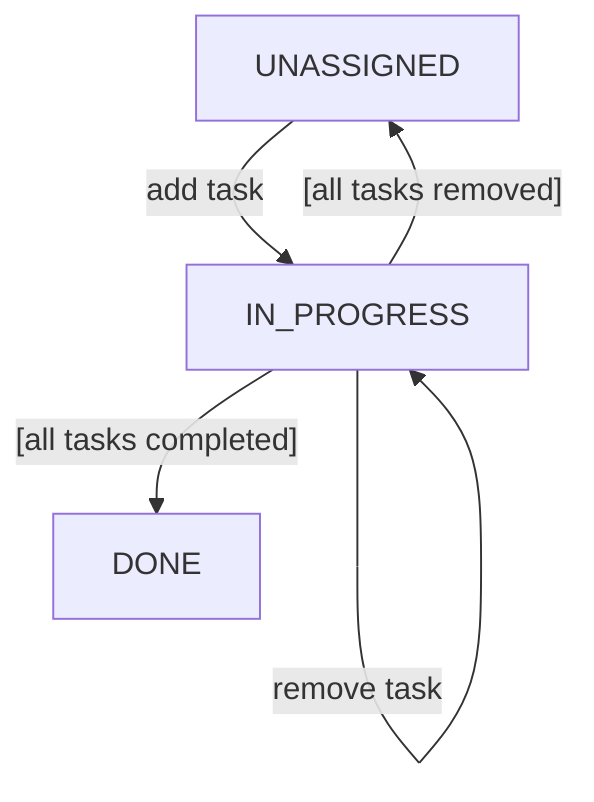

# swtGrocery Specification

The swtGrocery software shall provide a simple means to create Tasks and assign People to Tasks in the form of an
assignment (see **RQ1**). People can be imported from a JSON file (see **RQ2**). Furthermore, the system displays simple
statistics (see **RQ3**).

## Requirements

The following describes a list of requirements that shall be implemented by the swtGrocery software.

### RQ1: Task management

A `Person` is explicitly defined by:

* a unique `id`
* a `name`, which is neither empty nor contain only blanks
* a `taskLimit`, which specifies how many Assignments with status `TODO` a Person can be associated with, i.e., at least
  0.

swtGrocery shall not provide means to create, update, or delete a person. Person data is assumed to be present in the
database, or may be imported (see **RQ2**).

A `Task` is explicitly defined by:

* a unique `id`
* a `title`, which is neither empty nor contain only blanks
* a potentially empty `description`

swtGrocery should enable the user to create new tasks. Task creation must ensure that the above value constraints hold
afterwards. The user shall not be able to modify the task once the task has been created. The user shall not be able to
provide the id upon task creation, instead it should be chosen by the system automatically. swtGrocery shall not provide
means to delete a task.

An `Assignment` is explicitly defined by:

* a unique `id`
* the associated Person (`person`)
* the associated Task (`task`)
* a `status` that is either `TODO` or `DONE`

A Task can be assigned to no Person, a single Person, or multiple Person. A Task shall be assigned at most once to the
same Person, i.e., the same Person cannot be assigned more than once to a particular task. A newly created Assignment
shall always have status `TODO`. Once an Assignment has status `DONE`, it shall not be possible to update any of its
values, i.e., including its associated Task. However, it shall be possible to remove an Assignment from a Task while the
Assignment has status `TODO`.

The relationship between a Person and a Task is modeled using an Assignment. Based on the associated assignments and
their status, the status of the Task is considered to be the following:

* `UNASSIGNED` if no Assignment is associated with the task.
* `IN_PROGRESS` if at least one Assignment is associated with the task.
* `COMPLETED` if all Assignment associated with the task have status `DONE`.

#### Lifecycle diagram of a Task



### RQ2: Import Person entries from a local file

> Information on existing Employees are made available via a JSON file. The software shall provide means to import
> Person data from such a JSON file.

An `Employee` is explicitly defined by:

* a `name`
* `working_years` indicating how long the Employee is or has been working for the company
* a status indicator `active`, which indicates if the employee is still working at the company (`true`) or has left the
  company (`false`)

An Employee shall be mapped to a Person as follows:

* the name of an Employee shall represent the name of a Person
* an Employee shall only be mapped to a Person if the Employee is still active
* The taskLimit shall be identical to the working_years.

#### Sample JSON file

```json
[
    {
        "name": "John",
        "working_years": 3,
        "active": true
    },
        {
        "name": "Jane",
        "working_years": 20,
        "active": false
    }
]
```

### RQ3: Statistics

> The software shall provide the following simple statistics, which are to be used by the management.

1. Distribution of the task status among all Tasks. The software shall use a pie chart to indicate how many percent of
   all Tasks have status `UNASSIGNED`, `IN_PROGRESS`, and `COMPLETED`.
